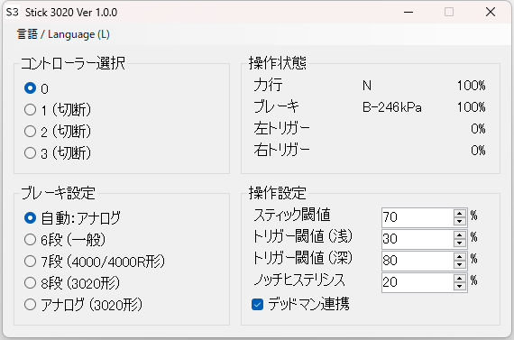

Stick 3020
==========

## これは何？

[TRAIN CREW](https://acty-soft.com/traincrew/) 用の外部ツールです。  
XInput対応コントローラーの左右スティックをそれぞれ3020形のマスコンハンドルとブレーキハンドルに見立て、電車を運転できるようにします。  
スティックをボタンのように使ってノッチを切り替える公式の操作方法とは違い、スティックを倒す方向をノッチに対応させて操作します。  
3020形以外も運転できます。

## 操作方法

### スティック操作

運転中は、常にスティックを傾けておくのが基本です。  
スティックを戻すと、デッドマンにより電車を停止させます。(設定で無効化可能)

マスコンハンドル (左スティック) は、右上45度が N に対応します。  
そこから反時計回りに回すと抑速、時計回りに回すと力行です。  
30度回すごとに1段進みます。

ブレーキハンドル (右スティック) は、左がユルメ、下が常用最大、右下45度が非常に対応します。  
※これらの中間の位置で判定を切り替えるため、45度よりも浅い角度で非常に入ります。特に一旦非常ブレーキをかけると解除までに長時間かかる3020形では注意！

### その他の操作

* L1：EBリセット
* R1：連絡ブザー
* RT浅押し：電笛
* RT深押し：(電笛+)空笛

## ライセンス

Stick 3020 は、MITライセンスです。

TrainCrewInput.dll (TRAIN CREW 入出力ライブラリ) は溝月レイル/Acty様の制作物であり、MITライセンスの対象外です。
TrainCrewInput.dll の解析や改変は禁止されています。

## ビルド方法

Windows 環境では、以下の方法でビルドを行います。

1. `make` コマンドを使えるようにする  
   例えば [Make for Windows](https://gnuwin32.sourceforge.net/packages/make.htm) をインストールする
2. C# コンパイラ `csc.exe` があるディレクトリにパスを通す  
   例えば `C:\Windows\Microsoft.NET\Framework\v4.0.30319`
3. `make` コマンドを実行する
